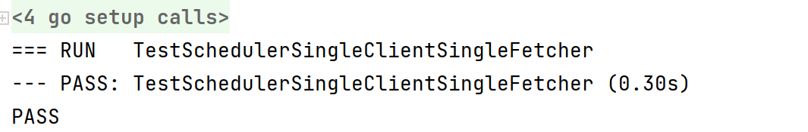

# Core-BloomBits

## scheduler

​	对于单纯的scheduler.go项目分析，感觉用scheduler_test.go来进行分析整一个流程是最好的。

​	首先记忆一下数据结构。request就是发送的请求，section 表示区块段号，每段4096个区块， bit代表检索的是布隆过滤器的哪一位。

response表示回应。scheduler是基于section的布隆过滤器的单个bit值检索的调度。 除了调度检索操作之外，这个结构还可以对请求进行重复数据删除并缓存结果，从而即使在复杂的过滤情况下也可以将网络/数据库开销降至最低。

```go
type request struct {
   section uint64 // Section index to retrieve the a bit-vector from
   bit     uint   // Bit index within the section to retrieve the vector of
}

// response represents the state of a requested bit-vector through a scheduler.
type response struct {
   cached []byte        // Cached bits to dedup multiple requests
   done   chan struct{} // Channel to allow waiting for completion
}

// scheduler handles the scheduling of bloom-filter retrieval operations for
// entire section-batches belonging to a single bloom bit. Beside scheduling the
// retrieval operations, this struct also deduplicates the requests and caches
// the results to minimize network/database overhead even in complex filtering
// scenarios.
type scheduler struct {
   bit       uint                 // Index of the bit in the bloom filter this scheduler is responsible for
   responses map[uint64]*response // Currently pending retrieval requests or already cached responses
   lock      sync.Mutex           // Lock protecting the responses from concurrent access
}
```

​	首先要能够通过编译运行。对于下述测试函数，需要有如下结果(IDEA环境，已将给定的requests从5000改为20)

```go
func TestSchedulerSingleClientSingleFetcher(t *testing.T) { testScheduler(t, 1, 1, 20) }
```



​     然后对代码进行分析，首先就是一系列的初始化，f(最核心的scheduler),fetchPend(同步作用)，fetch(接收request的管道)，这里用了一个sync.WaitGroup这个结构，其实就是提供了一个等待所有goroutines完成，才能进行下面所有操作的服务，起到同步的作用。具体可以看官网https://pkg.go.dev/sync#WaitGroup

```go
func testScheduler(t *testing.T, clients int, fetchers int, requests int) {
   //做了一个新的Scheduler
   f := newScheduler(0)

   // Create a batch of handler goroutines that respond to bloom bit requests and
   // deliver them to the scheduler.
   //创建一批处理程序的goroutines，以响应bloom bit请求并将它们交付给调度程序。
   // fetchPend提供了一个阻塞，只有所有的goroutines都完成之后才能进行下面的操作，具体可见https://pkg.go.dev/sync#WaitGroup
   var fetchPend sync.WaitGroup
   fetchPend.Add(fetchers)
   defer fetchPend.Wait()
   //做了大小为16的fetch
   fetch := make(chan *request, 16)
   defer close(fetch)
    ...
    ...
}
```

newScheduler()没什么好说的，就是一个单纯的初始化

```go
func newScheduler(idx uint) *scheduler {
   return &scheduler{
      bit:       idx,
      responses: make(map[uint64]*response),
   }
}
```

我们先跳过testScheduler中关于fetchers的goroutine，这是对接收到的信息进行处理的过程，我们还未发送信息->fetch。我们首先来看有关模拟客户端的这个goroutine。一开始做了两个管道in和out,然后就调用了Scheduler的核心函数run,同时往in里面输入请求，并企图从out里面读出数据，进行对比看是否达到效果。

```go
func testScheduler(t *testing.T, clients int, fetchers int, requests int) {
	...
   // Start a batch of goroutines to concurrently run scheduling tasks
   quit := make(chan struct{})

   var pend sync.WaitGroup
   pend.Add(clients)

   for i := 0; i < clients; i++ {
      go func() {
         defer pend.Done()

         in := make(chan uint64, 16)
         out := make(chan []byte, 16)

         f.run(in, fetch, out, quit, &pend)

         go func() {
            for j := 0; j < requests; j++ {
               in <- uint64(j)
            }
            close(in)
         }()

         for j := 0; j < requests; j++ {
            bits := <-out
            if want := new(big.Int).SetUint64(uint64(j)).Bytes(); !bytes.Equal(bits, want) {
               t.Errorf("vector %d: delivered content mismatch: have %x, want %x", j, bits, want)
            }
         }
      }()
   }
   pend.Wait()
    ...
}
```

run启动了两个goroutine，scheduleRequests与scheduleDeliveries，首先来看scheduleRequests的输入参数，也就是刚刚所说的in(输入请求的管道),fetch(输出请求的管道),新建的pend，quit(退出命令管道)，wg(同步机制)

```go
func (s *scheduler) run(sections chan uint64, dist chan *request, done chan []byte, quit chan struct{}, wg *sync.WaitGroup) {
   // Create a forwarder channel between requests and responses of the same size as
   // the distribution channel (since that will block the pipeline anyway).
   pend := make(chan uint64, cap(dist))

   // Start the pipeline schedulers to forward between user -> distributor -> user
   wg.Add(2)
   go s.scheduleRequests(sections, dist, pend, quit, wg)
   go s.scheduleDeliveries(pend, done, quit, wg)
}
```

scheduleRequests():从reqs中读取请求，分析出请求的section，如果这个请求对应的恢复responses[section]是个空，那么就新建一个responses.如果是个空则将**request发送给dist**也就是刚刚所说的fecth(可能就是说第一次收到请求，那么就对请求进行其他函数的处理).同时将**section发送给pend**.

```go
func (s *scheduler) scheduleRequests(reqs chan uint64, dist chan *request, pend chan uint64, quit chan struct{}, wg *sync.WaitGroup) {
   // Clean up the goroutine and pipeline when done
   defer wg.Done()
   defer close(pend)

   // Keep reading and scheduling section requests
   for {
      select {
      case <-quit:
         return

      case section, ok := <-reqs:
         // New section retrieval requested
         if !ok {
            return
         }
         // Deduplicate retrieval requests
         unique := false

         s.lock.Lock()
         if s.responses[section] == nil {
            //新建了一个response
            s.responses[section] = &response{
               done: make(chan struct{}),
            }
            unique = true
         }
         s.lock.Unlock()

         // Schedule the section for retrieval and notify the deliverer to expect this section
         //安排该部分进行检索，并通知交货者这个部分
         if unique {
            select {
            case <-quit:
               return
            case dist <- &request{bit: s.bit, section: section}:
            }
         }
         select {
         case <-quit:
            return
         case pend <- section:
         }
      }
   }
}
```

首先来看刚才遗漏掉的testScheduler的一段，可以看到当scheduleRequests给fetch中传送信息之后，(假装对消息进行处理得到结果，就是data)，调用deliver对消息结果(回信)进行返回

```go
func testScheduler(t *testing.T, clients int, fetchers int, requests int) {
	...
for i := 0; i < fetchers; i++ {
   //开了goroutine
   go func() {
      defer fetchPend.Done()
      //当管道里有req时
      for req := range fetch {
		
         time.Sleep(time.Duration(rand.Intn(int(100 * time.Microsecond))))
         atomic.AddUint32(&delivered, 1)

         f.deliver([]uint64{
            req.section + uint64(requests), // Non-requested data (ensure it doesn't go out of bounds)
            req.section,                    // Requested data
            req.section,                    // Duplicated data (ensure it doesn't double close anything)
         }, [][]byte{
            {},
            new(big.Int).SetUint64(req.section).Bytes(),
            new(big.Int).SetUint64(req.section).Bytes(),
         })
      }
   }()
}
    ...
}
```

scheduleDeliveries()：从pend中读出对应的section，也就是这里所写的idx，对应的responses序号

```go
func (s *scheduler) scheduleDeliveries(pend chan uint64, done chan []byte, quit chan struct{}, wg *sync.WaitGroup) {
   // Clean up the goroutine and pipeline when done
   defer wg.Done()
   defer close(done)

   // Keep reading notifications and scheduling deliveries
   for {
      select {
      case <-quit:
         return

      case idx, ok := <-pend:
         // New section retrieval pending
         if !ok {
            return
         }
         // Wait until the request is honoured
         s.lock.Lock()
         res := s.responses[idx]
         s.lock.Unlock()

         select {
         case <-quit:
            return
         case <-res.done:
         }
         // Deliver the result
         select {
         case <-quit:
            return
         case done <- res.cached:
         }
      }
   }
}
```
